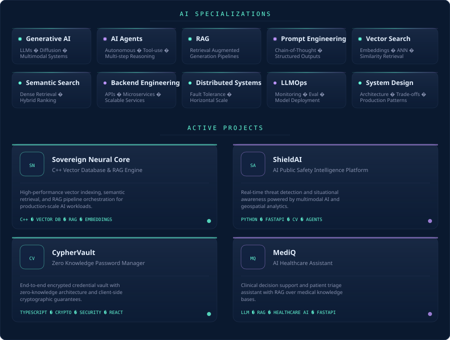

  

---

## `~/system/terminal`

---

## `~/stack/runtime`

---

## `~/core/specializations`

---

## `~/projects/active`

<table width="100%">
<tr>
<td width="50%" valign="top">

### Sovereign Neural Core

**C++ Vector Database & RAG Engine**

High-performance vector indexing, semantic retrieval, and RAG pipeline orchestration built for production-scale AI workloads.

`C++` `Vector DB` `RAG` `Embeddings`

</td>
<td width="50%" valign="top">

### ShieldAI

**AI Public Safety Intelligence Platform**

Real-time threat detection and situational awareness system powered by multimodal AI and geospatial analytics.

`Python` `FastAPI` `Computer Vision` `Agents`

</td>
</tr>
<tr>
<td width="50%" valign="top">

### CypherVault

**Zero Knowledge Password Manager**

End-to-end encrypted credential vault with zero-knowledge architecture and client-side cryptographic guarantees.

`TypeScript` `Cryptography` `Security` `React`

</td>
<td width="50%" valign="top">

### MediQ

**AI Healthcare Assistant**

Clinical decision support and patient triage assistant with RAG over medical knowledge bases.

`LLM` `RAG` `Healthcare AI` `FastAPI`

</td>
</tr>
</table>

---

## `~/metrics/live`

  

  

  

  

  

---

## `~/network/connect`

<table>
<tr>
<td align="center" width="120">
<a href="https://linkedin.com/in/rushikesh-ambhore">

 <b>LinkedIn</b>
</a>
</td>
<td align="center" width="120">
<a href="mailto:rushikesh.ambhore@outlook.com">

 <b>Email</b>
</a>
</td>
<td align="center" width="120">
<a href="https://rushikesh-ambhore.dev">

 <b>Portfolio</b>
</a>
</td>
<td align="center" width="120">
<a href="https://rushikesh-ambhore.dev/resume">

 <b>Resume</b>
</a>
</td>
<td align="center" width="120">
<a href="https://leetcode.com/rushikesh-ambhore">

 <b>LeetCode</b>
</a>
</td>
<td align="center" width="120">
<a href="https://github.com/rushikesh249">

 <b>GitHub</b>
</a>
</td>
</tr>
</table>

 

**Open to AI Internship Opportunities** · India · Building at the intersection of **AI Infrastructure** and **Intelligent Systems**

  

